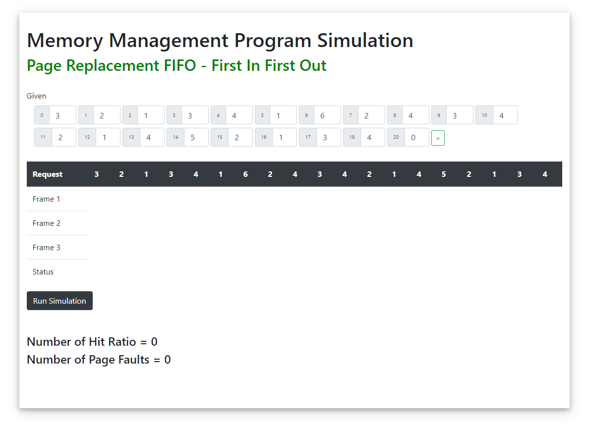

# Memory Management Program Simulation  
## Page Replacement FIFO - First In First Out
  
  
  
<blockquote className="blockquote text-right">  
	
<a href="https://www.youtube.com/watch?v=FWoMSiMep80&t=820s">Page replacement Introduction| FIFO page replacement algorithm with example| Operating System</a>
   
	<footer className="blockquote-footer">Credits to <cite title="Source Title">Jenny's lectures CS/IT NET&JRF</cite></footer>  
</blockquote>  
 
    

<blockquote className="blockquote text-right">  
	
<a href="https://www.youtube.com/watch?v=FWoMSiMep80&t=820s">Page Replacement FIFO - Memory Management Program Simulation</a>
  
	<footer className="blockquote-footer">Develop by <cite title="Source Title"><a href="https://github.com/kenntinio">Kenn Tinio</a></cite>  </footer>  
</blockquote>  